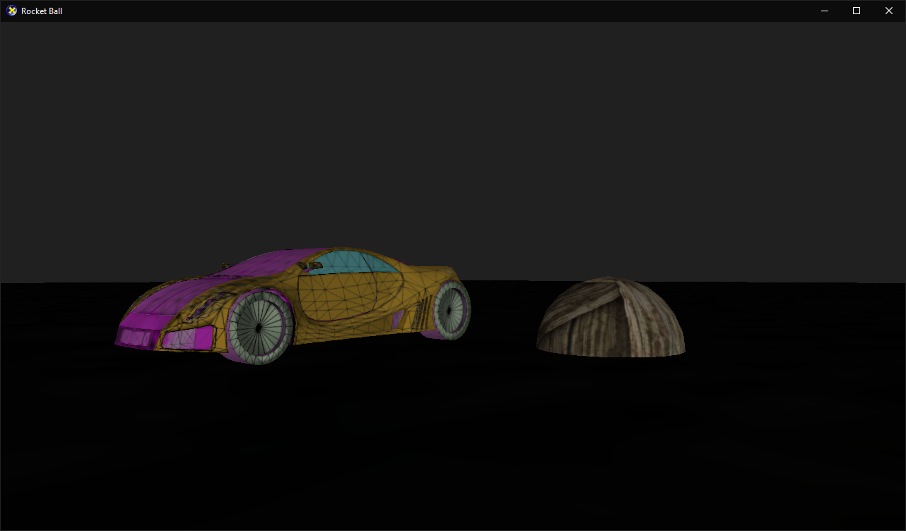

# 🚀⚽ RocketBall

#### This is my submission for my 2nd year graphics project: Rocketball

A re-creation of the well known title Rocket League, but on a much smaller scale.

 

# Controls
 - **WASD:** Selected object movement (Forward, left, backward & right)
 - **Space:** Apply an upwards jump force to the selected game object
 - **Q:** Hold to pause physics
 - **R:** Reset all game objects position to defaults
 - **T:** Toggle game object transparency
 - **Y:** Toggle game objects wireframe rendering

# Video

# Screenshots

### Default Renderer

### Wireframe Renderer

### Transparency Renderer

### Wireframe Renderer + Transparency Renderer

## License

MIT
